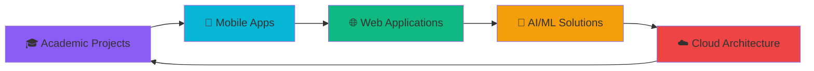

#  Hi there, I'm **Shivam Yadav** 

### 🎓 **Computer Science Engineering Student** | **Full-Stack Developer** | **AI/ML Enthusiast**


## 🚀 **About Me**

```dart
class ShivamYadav {
  String name = "Shivam Yadav";
  String role = "Full-Stack Developer & AI Enthusiast";
  String university = "Chandigarh University";
  String program = "Bachelor of Engineering - CSE";
  int semester = 1;
  String location = "Nepal 🇳🇵";
  String birthday = "August 21";
  
  List<String> passions = [
    "Mobile App Development",
    "Web Development", 
    "Machine Learning",
    "Data Science",
    "UI/UX Design",
    "Cloud Computing"
  ];
  
  List<String> currentFocus = [
    "Flutter & Dart",
    "Python & Data Science",
    "React & Node.js",
    "AI/ML Implementation",
    "Cloud Architecture"
  ];
  
  String motto = "Building Tomorrow's Technology Today";
}
```

---

## 🛠️ **Tech Stack & Expertise**

### 🎯 **Core Technologies**

  

### 🌐 **Frontend Development**

    

### ⚙️ **Backend & Database**


### 🤖 **AI/ML & Data Science**

  

### ☁️ **Cloud & DevOps**

    

### 📱 **Mobile Development**

   

---

## 📊 **GitHub Statistics**


---

## 🚀 **Featured Projects**

### 🎓 **Academy Intranet** - *Revolutionary Dating Platform*

[](https://github.com/codexshivam/academy)

**An exclusive, conversation-first dating app for verified college students**

[](https://flutter.dev)
[](https://appwrite.io)
[](https://firebase.google.com)

**🌟 Key Features:**
- 🔐 **Smart Verification System** - College email & ID verification
- 💬 **Conversation-First Matching** - Questions lead to connections
- 🎭 **Anonymous Experience** - Chat with nicknames before revealing identity
- 🛡️ **Advanced Safety** - Comprehensive moderation & privacy protection
- 📊 **Real-time Analytics** - Firebase integration for user insights

---

### 🎵 **AuraTune** - *Musical DNA Analysis*

[](https://auratune.shivamyadav.com.np)

**AI-Powered Musical Personality Analysis using NumPy & Pandas**

[](https://python.org)
[](https://numpy.org)
[](https://pandas.pydata.org)

**🧠 Technical Highlights:**
- 🔢 **NumPy Implementation** - Vectorized operations for audio feature processing
- 📊 **Pandas Analysis** - Data manipulation and user behavior insights
- 🎧 **Spotify Integration** - Real-time music data synchronization
- 📈 **Interactive Visualizations** - Beautiful radar charts and analytics
- ☁️ **Serverless Architecture** - Scalable cloud-based processing

---

## 🎯 **Current Focus & Learning**

### 🔥 **Active Development**



### 📚 **Learning Path**

- **🎯 Advanced Flutter** - Complex state management & custom widgets
- **🧠 Machine Learning** - Deep learning with TensorFlow & PyTorch
- **☁️ Cloud Computing** - AWS, GCP, and serverless architectures
- **🔒 Security** - Application security and best practices
- **📊 Data Science** - Advanced analytics and visualization

---

## 🏆 **Achievements & Recognition**

### 🎖️ **Academic Excellence**

- 🎓 **1st Semester CSE Student** at Chandigarh University
- 🏅 **High Academic Performance** in Computer Science
- 📚 **Active Learner** in emerging technologies
- 🔬 **Research-Oriented** approach to problem-solving

### 💻 **Technical Achievements**

- 🚀 **Full-Stack Developer** with multiple production projects
- 📱 **Mobile App Developer** with Flutter expertise
- 🤖 **AI/ML Practitioner** with real-world implementations
- ☁️ **Cloud Enthusiast** with modern architecture knowledge

### 🌟 **Community Impact**

- 👥 **Open Source Contributor** with active GitHub presence
- 📖 **Knowledge Sharer** through detailed project documentation
- 🤝 **Collaborative Developer** with strong teamwork skills
- 💡 **Innovation Driver** with creative problem-solving approach

---


---

## 🤝 **Connect With Me**

### 🌐 **Social Links**

[](https://twitter.com/ycsxshivam)
[](https://linkedin.com/in/ycsxshivam)
[](https://instagram.com/ycs.shivam)
[](https://facebook.com/ycsxshivam)
[](https://github.com/codexshivam)

### 📧 **Contact Information**

[](mailto:people@shivamyadav.com.np)
[](https://shivamyadav.com.np)

