<div align="center">

#  Hi there, I'm **Shivam Yadav** 

### 🎓 **Computer Science Engineering Student** | **Full-Stack Developer** | **AI/ML Enthusiast**

[](https://git.io/typing-svg)

---


</div>

---

## 🚀 **About Me**

<div align="center">


</div>

```dart
class ShivamYadav {
  String name = "Shivam Yadav";
  String role = "Full-Stack Developer & AI Enthusiast";
  String university = "Chandigarh University";
  String program = "Bachelor of Engineering - CSE";
  int semester = 1;
  String location = "Nepal 🇳🇵";
  String birthday = "August 21";
  
  List<String> passions = [
    "Mobile App Development",
    "Web Development", 
    "Machine Learning",
    "Data Science",
    "UI/UX Design",
    "Cloud Computing"
  ];
  
  List<String> currentFocus = [
    "Flutter & Dart",
    "Python & Data Science",
    "React & Node.js",
    "AI/ML Implementation",
    "Cloud Architecture"
  ];
  
  String motto = "Building Tomorrow's Technology Today";
}
```

---

## 🛠️ **Tech Stack & Expertise**

<div align="center">

### 🎯 **Core Technologies**


### 🌐 **Frontend Development**


### ⚙️ **Backend & Database**


### 🤖 **AI/ML & Data Science**


### ☁️ **Cloud & DevOps**


### 📱 **Mobile Development**


</div>

---

## 📊 **GitHub Statistics**

<div align="center">


### 🏆 **Profile Trophies**

[](https://github.com/ryo-ma/github-profile-trophy)

### 📈 **GitHub Stats**

<div align="center">


</div>

### 🔥 **Streak Stats**

<div align="center">


</div>

### 📊 **Activity Graph**

<div align="center">


</div>

</div>

---

## 🚀 **Featured Projects**

<div align="center">


</div>

### 🎓 **Academy Intranet** - *Revolutionary Dating Platform*

<div align="center">

[](https://github.com/codexshivam/academy)

**An exclusive, conversation-first dating app for verified college students**

[](https://flutter.dev)
[](https://appwrite.io)
[](https://firebase.google.com)

</div>

**🌟 Key Features:**
- 🔐 **Smart Verification System** - College email & ID verification
- 💬 **Conversation-First Matching** - Questions lead to connections
- 🎭 **Anonymous Experience** - Chat with nicknames before revealing identity
- 🛡️ **Advanced Safety** - Comprehensive moderation & privacy protection
- 📊 **Real-time Analytics** - Firebase integration for user insights

---

### 🎵 **AuraTune** - *Musical DNA Analysis*

<div align="center">

[](https://auratune.shivamyadav.com.np)

**AI-Powered Musical Personality Analysis using NumPy & Pandas**

[](https://python.org)
[](https://numpy.org)
[](https://pandas.pydata.org)

</div>

**🧠 Technical Highlights:**
- 🔢 **NumPy Implementation** - Vectorized operations for audio feature processing
- 📊 **Pandas Analysis** - Data manipulation and user behavior insights
- 🎧 **Spotify Integration** - Real-time music data synchronization
- 📈 **Interactive Visualizations** - Beautiful radar charts and analytics
- ☁️ **Serverless Architecture** - Scalable cloud-based processing

---

## 🎯 **Current Focus & Learning**

<div align="center">


</div>

### 🔥 **Active Development**

```mermaid
graph LR
    A[🎓 Academic Projects] --> B[📱 Mobile Apps]
    B --> C[🌐 Web Applications]
    C --> D[🤖 AI/ML Solutions]
    D --> E[☁️ Cloud Architecture]
    E --> A
    
    style A fill:#ff6b6b
    style B fill:#4ecdc4
    style C fill:#45b7d1
    style D fill:#96ceb4
    style E fill:#feca57
```



### 📚 **Learning Path**

- **🎯 Advanced Flutter** - Complex state management & custom widgets
- **🧠 Machine Learning** - Deep learning with TensorFlow & PyTorch
- **☁️ Cloud Computing** - AWS, GCP, and serverless architectures
- **🔒 Security** - Application security and best practices
- **📊 Data Science** - Advanced analytics and visualization

---

## 🏆 **Achievements & Recognition**

<div align="center">


</div>

### 🎖️ **Academic Excellence**

- 🎓 **1st Semester CSE Student** at Chandigarh University
- 🏅 **High Academic Performance** in Computer Science
- 📚 **Active Learner** in emerging technologies
- 🔬 **Research-Oriented** approach to problem-solving

### 💻 **Technical Achievements**

- 🚀 **Full-Stack Developer** with multiple production projects
- 📱 **Mobile App Developer** with Flutter expertise
- 🤖 **AI/ML Practitioner** with real-world implementations
- ☁️ **Cloud Enthusiast** with modern architecture knowledge

### 🌟 **Community Impact**

- 👥 **Open Source Contributor** with active GitHub presence
- 📖 **Knowledge Sharer** through detailed project documentation
- 🤝 **Collaborative Developer** with strong teamwork skills
- 💡 **Innovation Driver** with creative problem-solving approach

---

## 📈 **Coding Activity**

<div align="center">


### 📊 **Weekly Development Breakdown**

```text
Flutter/Dart     ████████████████████ 85%  ████████████████████
Python           ████████████████     70%  ████████████████
JavaScript/TS    ██████████████       60%  ██████████████
React/Node.js    ████████████         50%  ████████████
AI/ML            ██████████           40%  ██████████
Cloud/DevOps     ████████             35%  ████████
```

### 🎯 **2024 Goals**

- [ ] **Master Advanced Flutter** - Complex animations & custom widgets
- [ ] **Deep Dive into AI/ML** - Build production-ready ML models
- [ ] **Cloud Architecture** - Design scalable distributed systems
- [ ] **Open Source** - Contribute to major Flutter/Python projects
- [ ] **Technical Writing** - Share knowledge through blogs & tutorials

</div>

---

## 🤝 **Connect With Me**

<div align="center">


### 🌐 **Social Links**

[](https://twitter.com/ycsxshivam)
[](https://linkedin.com/in/ycsxshivam)
[](https://instagram.com/ycs.shivam)
[](https://facebook.com/ycsxshivam)
[](https://github.com/codexshivam)

### 📧 **Contact Information**

[](mailto:people@shivamyadav.com.np)
[](https://shivamyadav.com.np)

</div>

---

## 💡 **Fun Facts**

<div align="center">


### 🎂 **Personal Info**

- **🎂 Birthday**: August 21
- **🇳🇵 Location**: Nepal
- **🎓 Education**: Chandigarh University (CSE)
- **☕ Coffee**: Essential for coding marathons
- **🎵 Music**: Coding with Spotify in the background
- **🌙 Sleep**: "I'll fix this bug first" (famous last words)

### 🎯 **Coding Philosophy**

> *"Code is poetry written in logic, and every bug is a lesson waiting to be learned."*

### 🚀 **Current Status**

```dart
while (alive) {
    code();
    learn();
    build();
    share();
    sleep(); // optional
}
```

</div>

---

## 🎨 **GitHub Profile Views**

<div align="center">


### 📊 **Profile Statistics**


### 🌟 **Repository Stats**

[](https://github.com/codexshivam)
[](https://github.com/codexshivam)
[](https://github.com/codexshivam)

</div>

---

<div align="center">


## 🎯 **Let's Build Something Amazing Together!**


</div>
# codexshivam
